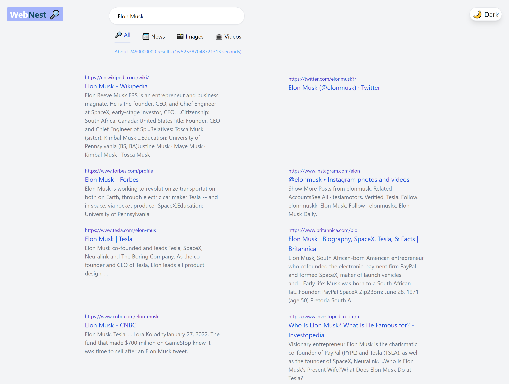
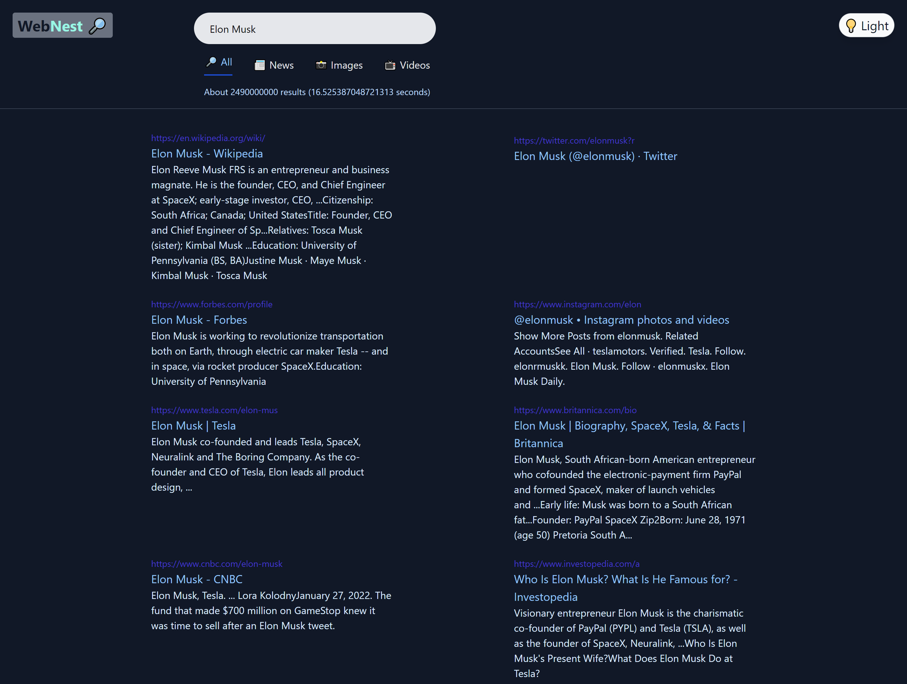
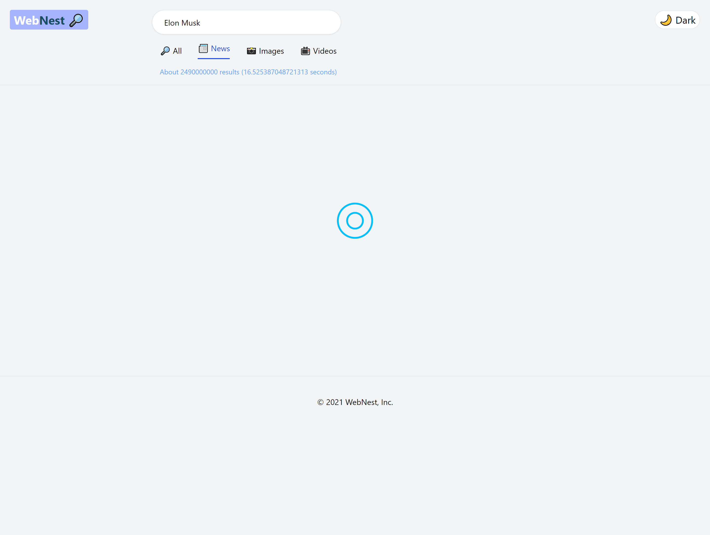
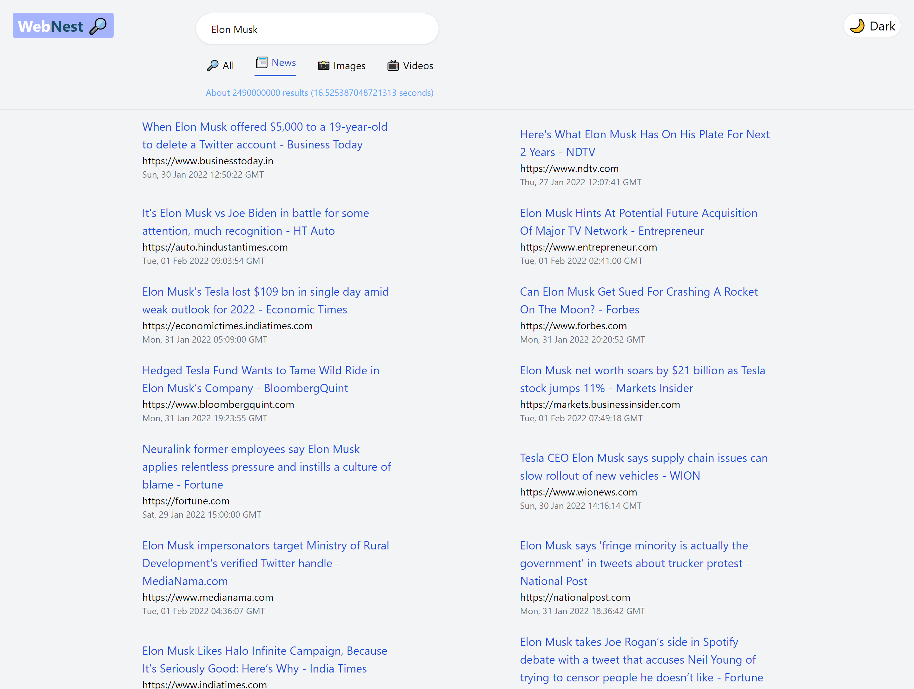
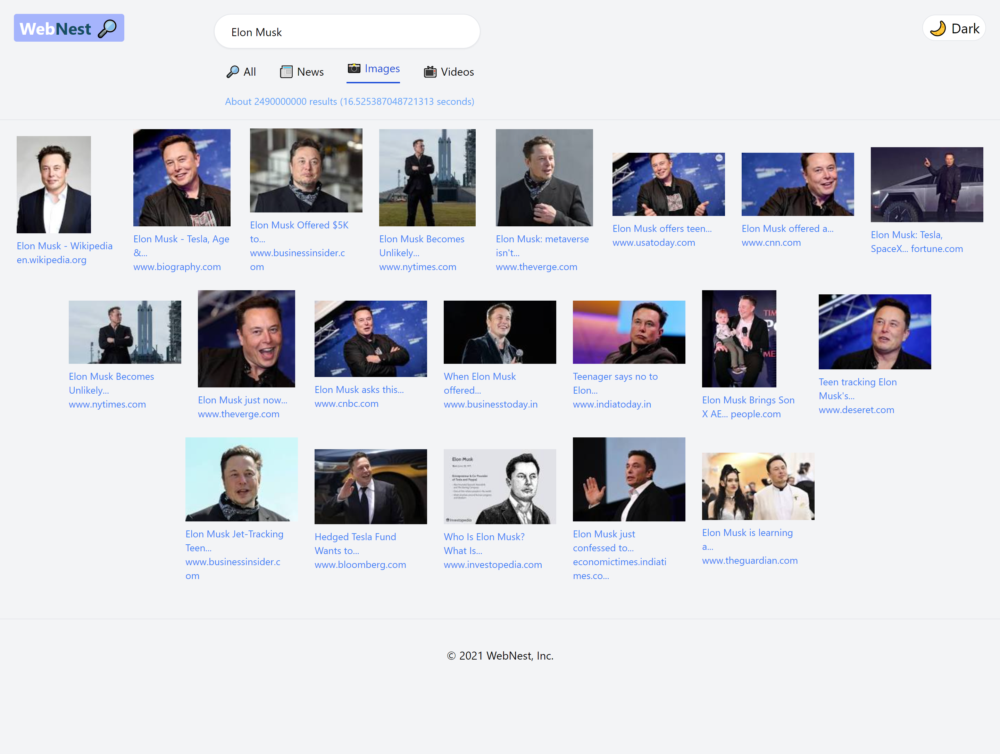
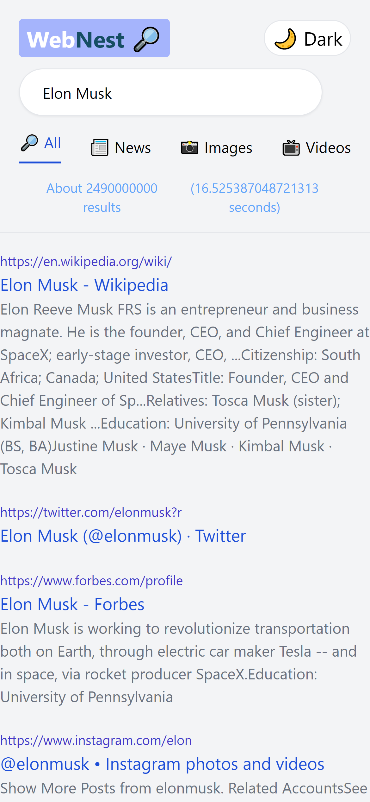
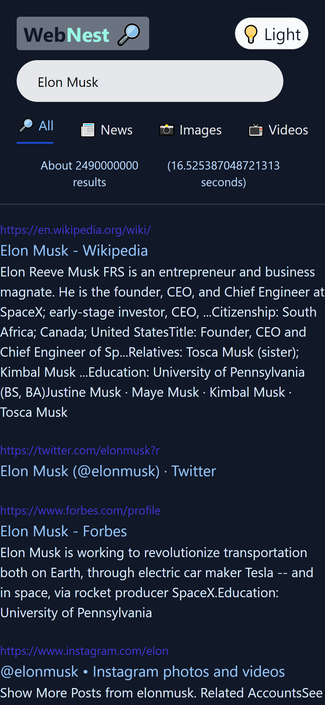

# WebNest

## Table of contents

- [Overview](#overview)
  - [Demo](#demo)
  - [Screenshot](#screenshot)
    - [Desktop](#desktop)
    - [Mobile](#mobile)
  - [Links](#links)
- [My process](#my-process)
  - [Built with](#built-with)
  - [What I learned](#what-i-learned)
- [Author](#author)


## Overview
With the ability to search for up-to-date results, news, images, and videos, modern UI, dark mode, this is a completely responsive Google Clone.
### Demo


### Screenshot

#### Desktop







#### Mobile




### Links

- Solution URL: [https://github.com/NandodkarAmogh/Bookverse#demo](https://github.com/NandodkarAmogh/Bookverse#demo)
- Live Site URL: [https://boookverse.netlify.app/](https://boookverse.netlify.app/)

## My process

### Built with

- Mobile-first workflow
- [React](https://reactjs.org/) - JS library
- [React Router](https://reactrouter.com/) 
- [Google Search API](https://rapidapi.com/apigeek/api/google-search3?utm_source=youtube.com%2FJavaScriptMastery&utm_medium=DevRel&utm_campaign=DevRel) - API
- [Tailwind CSS](https://tailwindcss.com/) - For styles
### What I learned

This is my first project in which I worked with Tailwind CSS. This project helped me in revising some of the core react concepts like react router and hooks like useState and useContext. 

```react

    export const ResultContextProvider = ({ children }) => {
    const [results, setResults] = useState([]);
    const [isLoading, setIsLoading] = useState(false);
    const [searchTerm, setSearchTerm] = useState('tesla');
    const [total, setTotal] = useState('');
    const [ts,setTs] = useState('')

    const getResults = async (type) => {
    setIsLoading(true);

    const response = await fetch(`${baseUrl}${type}`, {
      method: 'GET',
      headers: {
        'x-proxy-location': 'IN',
        'x-rapidapi-host': 'google-search3.p.rapidapi.com',
        'x-rapidapi-key': '0acf04ba65msh1fcb8e6e42cd3b7p1d3febjsn32ce491bdbf2',
      },
    });

    const data = await response.json();
    console.log(data);

    if(type.includes('/news')) {
      setResults(data.entries);
      // setNewsTotal(data.total);
    } else if(type.includes('/images')) {
      setResults(data.image_results);
      // setImagesTotal(data.total);
    } else {
      setResults(data.results);
      setTotal(data.total);
      setTs(data.ts)
    }

    setIsLoading(false);
    };
  
    return (
        <ResultContext.Provider value={{ getResults, results, searchTerm, setSearchTerm, isLoading, total, ts }}>
        {children}
        </ResultContext.Provider>
    );
};
```
## Author

- Github - [@NandodkarAmogh](https://github.com/NandodkarAmogh)


